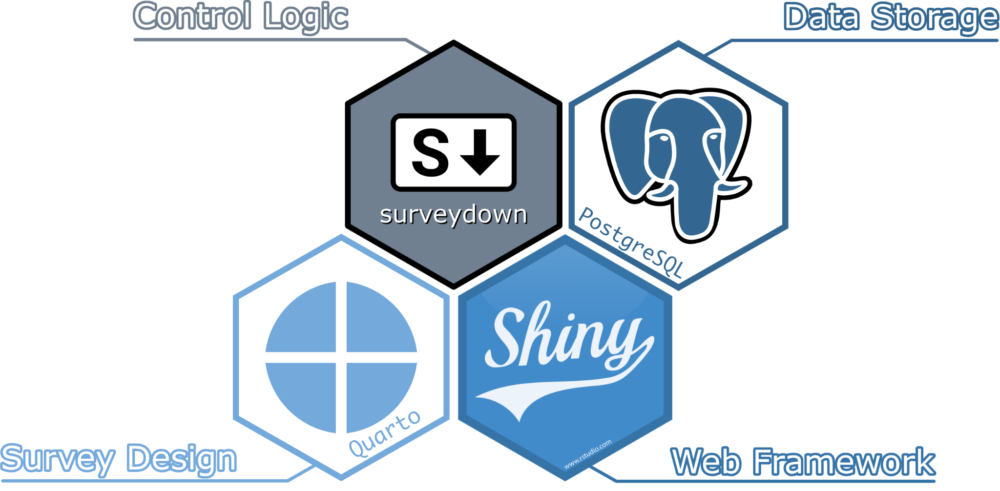

```{r setup, include=FALSE}
library(knitr)
library(fontawesome)
library(metathis)
library(surveydown)

options(
    htmltools.dir.version = FALSE,
    knitr.table.format = "html",
    knitr.kable.NA = '',
    dplyr.width = Inf,
    width = 250
)
knitr::opts_chunk$set(
    warning = FALSE,
    message = FALSE,
    fig.path = "figs/",
    fig.width = 7.252,
    fig.height = 4,
    comment = "#>",
    fig.retina = 3
)

# Setup xaringanExtra options
xaringanExtra::use_xaringan_extra(c(
  "tile_view", "panelset", "share_again"))
xaringanExtra::style_share_again(share_buttons = "none")
xaringanExtra::use_extra_styles(
  hover_code_line = TRUE,
  mute_unhighlighted_code = FALSE
)

# Set up website metadata
meta() %>%
  meta_general(
    description = rmarkdown::metadata$subtitle,
    generator = "xaringan and remark.js"
  ) %>%
  meta_name("github-repo" = "jhelvy/2025-posit-conf-surveydown") %>%
  meta_social(
    title = rmarkdown::metadata$title,
    url = "https://www.jhelvy.com/slides",
    og_type = "website",
    og_author = "John Paul Helveston",
    twitter_card_type = "summary_large_image"
  )
```

---

background-image: url("images/blue.jpg")
background-size: cover
class: inverse

<br><br><br><br>

## `r rmarkdown::metadata$title`

### `r rmarkdown::metadata$subtitle`

<br><br><br><br>

**.white[John Paul Helveston]**, George Washington University

`r rmarkdown::metadata$date`

---

background-image: url("images/ds1.png")
background-size: cover

---

background-image: url("images/ds2.png")
background-size: cover

---

background-color: #fff
class: center

# Typical experience making a survey

<center>

</center>

---

background-color: #fff
class: middle

.leftcol60[

<center>

</center>

]

.rightcol40[

### ❌ Reproducible
### ❌ Data Control
### ⚠️ Free to Use
### ⚠️ Open Source
### ⚠️ Easy Collaboration
### ⚠️ Feature Packed

]

---

class: center

## Introducing `surveydown`

<center>

</center>

---

class: center

# Components

<br>

.leftcol45[

### `survey.qmd` 

A **Quarto doc** defining the main survey content (pages, text, images, questions, etc).


]

.rightcol45[

### `app.R` 

An **R script** defining the survey Shiny app. It sets up the database and server, and launches the survey.

]

---

.leftcol[.code50[

````{markdown}
---
format: html
echo: false
warning: false
---

```{r}
library(surveydown)
```

::: {.sd_page id=welcome}

# Welcome to our survey!

```{r}
sd_question(
  type  = "mc",
  id    = "penguins",
  label = "What's your favorite penguin?",
  option = c(
    "Adélie"    = "adelie",
    "Chinstrap" = "chinstrap",
    "Gentoo"    = "gentoo"
  )
)

sd_next()
```

:::

::: {.sd_page id=end}

This is the last page of the survey.

```{r}
sd_close()
```

:::

````

]]

.rightcol[

# .center[survey.qmd]

]

---

.leftcol[.code50[

````{markdown}
--- #<<
format: html #<<
echo: false #<<
warning: false #<<
--- #<<
 
```{r} #<<
library(surveydown) #<<
``` #<<

::: {.sd_page id=welcome}

# Welcome to our survey!

```{r}
sd_question(
  type  = "mc",
  id    = "penguins",
  label = "What's your favorite penguin?",
  option = c(
    "Adélie"    = "adelie",
    "Chinstrap" = "chinstrap",
    "Gentoo"    = "gentoo"
  )
)

sd_next()
```

:::

::: {.sd_page id=end}

This is the last page of the survey.

```{r}
sd_close()
```

:::

````

]]

.rightcol[

YAML Header 

<br>
Load `surveydown` package

]

---

.leftcol[.code50[

````{markdown}
---
format: html
echo: false
warning: false
---

```{r}
library(surveydown)
```

::: {.sd_page id=welcome} #<<

# Welcome to our survey!

```{r}
sd_question(
  type  = "mc",
  id    = "penguins",
  label = "What's your favorite penguin?",
  option = c(
    "Adélie"    = "adelie",
    "Chinstrap" = "chinstrap",
    "Gentoo"    = "gentoo"
  )
)

sd_next()
```

::: #<<

::: {.sd_page id=end} #<<

This is the last page of the survey.

```{r}
sd_close()
```

::: #<<

````

]]

.rightcol[

Define pages using "fences"

````{markdown}
::: {.sd_page id=page_id}

Page content

:::
````

]

---

.leftcol[.code50[

````{markdown}
---
format: html
echo: false
warning: false
---

```{r}
library(surveydown)
```

::: {.sd_page id=welcome}

# Welcome to our survey! #<<

```{r} #<<
sd_question( #<<
  type  = "mc", #<<
  id    = "penguins", #<<
  label = "What's your favorite penguin?", #<<
  option = c( #<<
    "Adélie"    = "adelie", #<<
    "Chinstrap" = "chinstrap", #<<
    "Gentoo"    = "gentoo" #<<
  ) #<<
) #<<

sd_next() #<<
``` #<<

:::

::: {.sd_page id=end}

This is the last page of the survey.

```{r}
sd_close()
```

:::

````

]]

.rightcol[

<br><br><br><br><br>Use markdown for page content

Use `sd_question()` in code chunk for survey questions

<br><br>Use `sd_next()` for next button

]

---

.leftcol[.code70[

```{r}
#| eval: false

library(surveydown)

# Connects to database
db <- sd_db_connect()

# Main UI
ui <- sd_ui()

server <- function(input, output, session) {

  # Main server
  sd_server(db)
  
}

shiny::shinyApp(
  ui = ui, 
  server = server
)
```

]]

.rightcol[

# .center[app.R]

]

---

.leftcol[.code70[

```{r}
#| eval: false

library(surveydown) #<<

# Connects to database
db <- sd_db_connect() #<<

# Main UI
ui <- sd_ui() #<<

server <- function(input, output, session) {
  
  # Main server
  sd_server(db) #<<

}

shiny::shinyApp(
  ui = ui,
  server = server
)
```

]]

.rightcol[

Load package

Connect to database

Make standard UI 

<br>Run surveydown server

]

---

## YAML Header

The YAML header is at the top of the `.qmd` file:

``` yaml
---
format: html
echo: false
warning: false
---
```

---

## Change the survey theme 

Pick a different [bootswatch theme](https://bootswatch.com) with the `theme` key:

```{markdown}
---
format: html
echo: false
warning: false
theme: united #<<
---
```

Make a custom theme with a `custom.scss` file

```{markdown}
---
format: html
echo: false
warning: false
theme: [united, custom.scss] #<<
---
```

---

## Progress bar

You can modify the survey progress bar with the `barcolor` and `barposition` keys:

.leftcol[

Change to any color with `barcolor`:

```{markdown}
---
format: html
echo: false
warning: false
barcolor: #768692 #<<
---
```

]

.rightcol[

Change position: `top`, `bottom`, or `none`

```{markdown}
---
format: html
echo: false
warning: false
barposition: bottom #<<
---
```

]

---

# Inserting pages

Insert new pages with `:::` symbols, like this

```{r}
#| eval: false

::: {.sd_page id=page_id}

Page content here

:::
```

--

Insert next buttons with the `sd_next()` function, like this (blank goes to next page):

````markdown
`r ''````{r}
sd_next('next_page_id')
```
````

---

# Inserting questions

Insert questions using the `sd_question()` function, like this:

.leftcol[

**Code**

```{r}
#| eval: false

sd_question(
  type   = 'mc',
  id     = 'fruit',
  label  = "1. Do you like fruit?",
  option = c(
    'Yes!'    = 'yes',
    'Kind of' = 'kind_of',
    'No :('   = 'no'
  )
)
```

Format is `"Label = value"`

]

.rightcol[

**Output**

```{r}
#| echo: false

sd_question(
  type   = 'mc',
  id     = 'fruit',
  label  = "1. Do you like fruit?",
  option = c(
    'Yes!'    = 'yes',
    'Kind of' = 'kind_of',
    'No :('   = 'no'
  )
)
```

]

---

## surveydown supports lots of [question types](https://surveydown.org/docs/question-types)

Some common types you may want to use:

Type | Description
-----|---------------------
`mc` | Multiple choice question (single choice) 
`mc_multiple` | Multiple choice question (multiple choices) 
`mc_buttons` | Multiple choice question (large buttons)
`select` | Drop down menu (choose one)
`text` | Open text, single row
`textarea` | Open text, block

---

# Embed images with html

I recommend just writing html code, like this

```{html, eval=FALSE}
<center>

</center>
```

<center>

</center>

---

# Embed images with markdown

```{html, eval=FALSE}
{fig-align="center" width="250"}
```

<center>

</center>

---

class: center, middle

# Try out the surveydown [studio app](https://github.com/surveydown-dev/sdApps)

## `sdApps::sd_studio()`

---

class: inverse 
background-image: url("images/blue.jpg")
background-size: cover

<br>

# Thanks!

<br>

### <span class="white-text">https://jhelvy.github.io/2025-posit-conf-surveydown</span>

<style>
.white-text a {
  color: white !important;
}
</style>

.footer-large[.white[.right[

@jhelvy.bsky.social `r fa(name = "bluesky", fill = "white")`<br>
@jhelvy `r fa(name = "github", fill = "white")`<br>
jhelvy.com `r fa(name = "link", fill = "white")`<br>
jph@gwu.edu `r fa(name = "paper-plane", fill = "white")`

]]]
