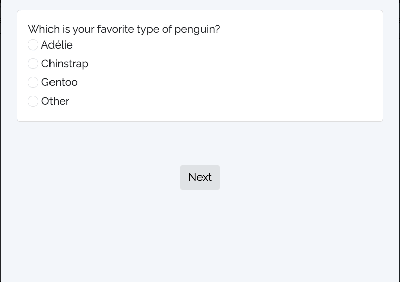
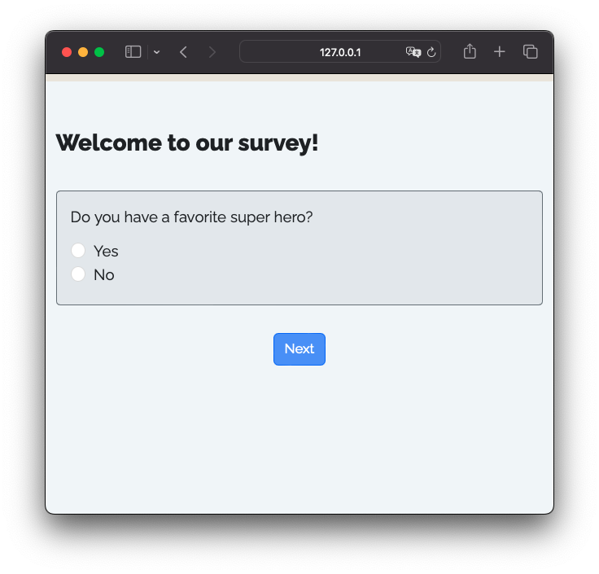

```{r setup, include=FALSE}
library(knitr)
library(fontawesome)
library(metathis)
library(surveydown)

options(
    htmltools.dir.version = FALSE,
    knitr.table.format = "html",
    knitr.kable.NA = '',
    dplyr.width = Inf,
    width = 250
)
knitr::opts_chunk$set(
    warning = FALSE,
    message = FALSE,
    fig.path = "figs/",
    fig.width = 7.252,
    fig.height = 4,
    comment = "#>",
    fig.retina = 3
)

# Setup xaringanExtra options
xaringanExtra::use_xaringan_extra(c(
  "tile_view", "panelset", "share_again"))
xaringanExtra::style_share_again(share_buttons = "none")
xaringanExtra::use_extra_styles(
  mute_unhighlighted_code = FALSE
)

# Set up website metadata
meta() %>%
  meta_general(
    description = rmarkdown::metadata$subtitle,
    generator = "xaringan and remark.js"
  ) %>%
  meta_name("github-repo" = "jhelvy/2025-posit-conf-surveydown") %>%
  meta_social(
    title = rmarkdown::metadata$title,
    url = "https://www.jhelvy.com/slides",
    og_type = "website",
    og_author = "John Paul Helveston",
    twitter_card_type = "summary_large_image"
  )
```

background-image: url("images/blue.jpg")
background-size: cover
class: inverse

<br><br><br><br>

## `r rmarkdown::metadata$title`

### `r rmarkdown::metadata$subtitle`

<br><br><br><br>

**.white[John Paul Helveston]**, George Washington University

`r rmarkdown::metadata$date`

---

class: center, middle

<center>

</center>

---

background-image: url("images/images/Slide1.png")
background-size: cover

---

background-image: url("images/images/Slide2.png")
background-size: cover

---

background-image: url("images/images/Slide3.png")
background-size: cover

---

background-image: url("images/images/Slide4.png")
background-size: cover

---

background-image: url("images/images/Slide5.png")
background-size: cover

---

background-image: url("images/images/Slide6.png")
background-size: cover

---

background-image: url("images/images/Slide7.png")
background-size: cover

---

background-image: url("images/images/Slide8.png")
background-size: cover

---

class: center, middle, inverse

# Wouldn't it be nice if there was a<br>"Quarto" for surveys?

--

<center>

</center>

---

class: middle 

.leftcol40[

# In this talk,<br>you'll learn:

]

.rightcol60[

## - What is `surveydown`?

## - How does it work?

## - What can I do with it?

## - What's next?

]

---

class: center, middle, inverse

# What is `surveydown`?

---

background-image: url("images/images/Slide10.png")
background-size: cover

---

.leftcol40[.code80[

````{markdown}
---
format: html
echo: false
warning: false
---

```{r}
library(surveydown)
```

::: {.sd_page id=welcome}

# Welcome to our survey!

```{r}
sd_question(
  type  = "text",
  id    = "name",
  label = "Who's your favorite super hero?"
)

sd_next()
```

:::
````

]]

.rightcol60[

.center[`survey.qmd` --> Rendered survey]

<center>

</center>

]

---

.leftcol40[.code80[

````{markdown}
--- #<<
format: html #<<
echo: false #<<
warning: false #<<
--- #<<

```{r}
library(surveydown)
```

::: {.sd_page id=welcome}

# Welcome to our survey!

```{r}
sd_question(
  type  = "text",
  id    = "name",
  label = "What's your name?"
)

sd_next()
```

:::
````

]]

.rightcol60[

### .center[Standard YAML header<br>w/options for "clean" output]

]

---

.leftcol40[.code80[

````{markdown}
---
format: html
echo: false
warning: false
---

```{r} #<<
library(surveydown) #<<
``` #<<

::: {.sd_page id=welcome}

# Welcome to our survey!

```{r}
sd_question(
  type  = "text",
  id    = "name",
  label = "What's your name?"
)

sd_next()
```

:::
````

]]

.rightcol60[

<br><br><br><br>

### .center[Load the `surveydown` package]

]

---

.leftcol40[.code80[

````{markdown}
---
format: html
echo: false
warning: false
---

```{r}
library(surveydown) 
```

::: {.sd_page id=welcome} #<<

# Welcome to our survey!

```{r}
sd_question(
  type  = "text",
  id    = "name",
  label = "What's your name?"
)

sd_next()
```

::: #<<
````

]]

.rightcol60[

<br><br><br><br><br><br>

### .center[Use Quarto fences (`:::`)<br>to define survey pages]

]

---

.leftcol40[.code80[

````{markdown}
---
format: html
echo: false
warning: false
---

```{r}
library(surveydown) 
```

::: {.sd_page id=welcome} 

# Welcome to our survey! #<<
   #<<
```{r} #<<
sd_question( #<<
  type  = "text", #<<
  id    = "name", #<<
  label = "What's your name?" #<<
) #<<
   #<<
sd_next() #<<
``` #<<

::: 
````

]]

.rightcol60[

<br><br><br><br><br><br><br><br>

### .center[Page content]

- Markdown for page content (text, images, etc.)
- `sd_question()` for survey questions
- `sd_next()` for next button

]

---

.leftcol40[.code80[

````{markdown}
---
format: html
echo: false
warning: false
---

```{r}
library(surveydown)
```

::: {.sd_page id=welcome}

# Welcome to our survey!

```{r}
sd_question(
  type  = "text",
  id    = "name",
  label = "What's your name?"
)

sd_next()
```

:::
````

]]

.rightcol60[

.center[`survey.qmd` --> Rendered survey]

<center>

</center>

]

---

class: middle, inverse

# .center[Wait a minute...<br>Quarto renders to _static_ html pages, right?]

<center>

</center>

---

class: middle, inverse

# .center[Wait a minute...<br>Quarto renders to _static_ html pages, right?]

.leftcol[

<center>

</center>

]

.rightcol[
<center>

</center>

]

---

background-image: url("images/images/Slide11.png")
background-size: cover

---

background-image: url("images/images/Slide12.png")
background-size: cover

---

background-image: url("images/images/Slide13.png")
background-size: cover

---

class: center

# A complete `surveydown` survey

<br>

.leftcol45[

### `survey.qmd` 

.font120[A **Quarto doc** defining the survey content (pages, text, images, questions, etc).]

]

.rightcol55[

### `app.R` 

.font120[An **R script** defining the<br>survey Shiny app.]

]

---

.leftcol65[.code90[

Typical `app.R` file

```{r}
#| eval: false

library(surveydown)

ui <- sd_ui() 

server <- function(input, output, session) { 
  
  sd_server()
   
} 

shiny::shinyApp(ui = ui, server = server)
```

]]

---

.leftcol65[.code90[

Typical `app.R` file

```{r}
#| eval: false

library(surveydown)

ui <- sd_ui() #<<

server <- function(input, output, session) { 
  
  sd_server() #<<
   
} 

shiny::shinyApp(ui = ui, server = server)
```

]]

.rightcol35[

<br><br><br>

Render the `survey.qmd` file

<br>

Run the surveydown server

]

---

class: middle, inverse, center

# What can `surveydown` do?

---

## .center[Surveydown supports most common survey features]

<br><br>

.leftcol25[]

.rightcol75[

## - Lots of question types

## - Conditionally display content

## - Conditionally skip forward

]

---

# .center[Question types: `text`]

.leftcol[

```{r}
#| eval: false

sd_question(
  type  = "text",
  id    = "name",
  label = "Who's your favorite super hero?"
)
```

]

.rightcol[

```{r}
#| echo: false

sd_question(
  type  = "text",
  id    = "name",
  label = "Who's your favorite super hero?"
)
```

]

---

# Conditionally display content

# Conditionally skip forward

---

class: center, middle, inverse

# If it works in Shiny, it works in surveydown

---

Cool map example

---

class: center, middle, inverse

# What's next?

---

class: center, middle

# Try out the surveydown [studio app](https://github.com/surveydown-dev/sdApps)

## `sdApps::sd_studio()`

---

class: middle, center 

# You can help!

---

class: inverse 
background-image: url("images/blue.jpg")
background-size: cover

<br>

# Thanks!

<br>

### <span class="white-text">https://jhelvy.github.io/2025-posit-conf-surveydown</span>

<style>
.white-text a {
  color: white !important;
}
</style>

.footer-large[.white[.right[

@jhelvy.bsky.social `r fa(name = "bluesky", fill = "white")`<br>
@jhelvy `r fa(name = "github", fill = "white")`<br>
jhelvy.com `r fa(name = "link", fill = "white")`<br>
jph@gwu.edu `r fa(name = "paper-plane", fill = "white")`

]]]
