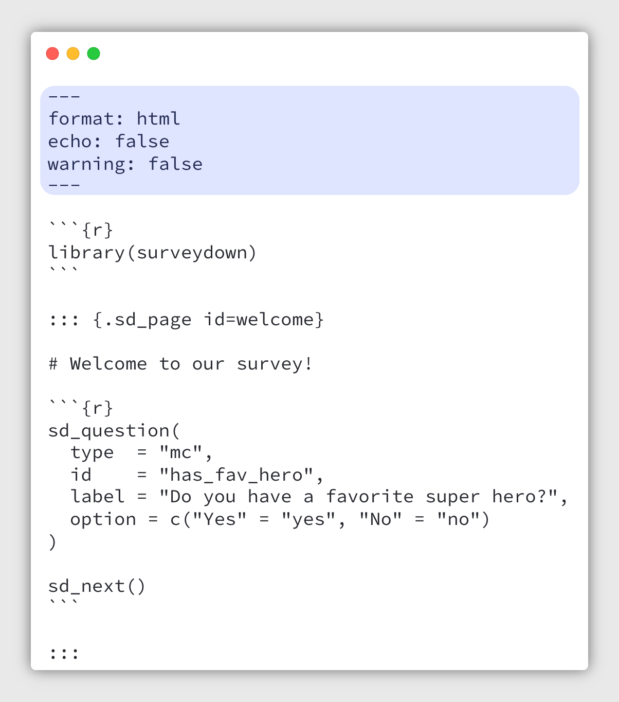

```{r setup, include=FALSE}
library(knitr)
library(fontawesome)
library(metathis)
library(surveydown)

options(
    htmltools.dir.version = FALSE,
    knitr.table.format = "html",
    knitr.kable.NA = '',
    dplyr.width = Inf,
    width = 250
)
knitr::opts_chunk$set(
    warning = FALSE,
    message = FALSE,
    fig.path = "figs/",
    fig.width = 7.252,
    fig.height = 4,
    comment = "#>",
    fig.retina = 3
)

# Setup xaringanExtra options
xaringanExtra::use_xaringan_extra(c(
  "tile_view", "panelset", "share_again"))
xaringanExtra::style_share_again(share_buttons = "none")
xaringanExtra::use_extra_styles(
  mute_unhighlighted_code = FALSE
)

# Set up website metadata
meta() %>%
  meta_general(
    description = rmarkdown::metadata$subtitle,
    generator = "xaringan and remark.js"
  ) %>%
  meta_name("github-repo" = "jhelvy/2025-posit-conf-surveydown") %>%
  meta_social(
    title = rmarkdown::metadata$title,
    url = "https://www.jhelvy.com/slides",
    og_type = "website",
    og_author = "John Paul Helveston",
    twitter_card_type = "summary_large_image"
  )
```

background-image: url("images/blue.jpg")
background-size: cover
class: inverse

<br><br><br><br>

## `r rmarkdown::metadata$title`

### `r rmarkdown::metadata$subtitle`

<br><br><br><br>

**.white[John Paul Helveston]**, George Washington University

`r rmarkdown::metadata$date`

---

background-color: #000
class: center, middle, inverse

# I try to figure out what people want

<center>

</center>

---

class: center, middle

<center>

</center>

---

class: center, middle

### WYSIWYG Interface

<center>

</center>

---

class: middle

.leftcol65[

<center>

</center>

]

.rightcol35[

# Limitations

<br>

## .font80[❌] Reproducibility

]

---

class: middle

.leftcol65[

<center>

</center>

]

.rightcol35[

# Limitations

<br>

## .font80[❌] Reproducibility

## .font80[❌] Version control

]

---

<center>

</center>

---

class: middle

.leftcol65[

<center>

</center>

]

.rightcol35[

# Limitations

<br>

## .font80[❌] Reproducibility

## .font80[❌] Version control

## .font80[❌] Limited features

]

---

class: middle

.leftcol65[

<center>

</center>

]

.rightcol35[

# Limitations

<br>

## .font80[❌] Reproducibility

## .font80[❌] Version control

## .font80[❌] Limited features

## .font80[❌] Open source

]

---

.leftcol60[

<br><br>
<center>

</center>

]

.rightcol40[

<br>

# ~~Limitations~~ Features

<br>

## &#x2705; Reproducibility

## &#x2705; Version control

## &#x2705; Lots of Features

## &#x2705; Open source

]

---

class: center, middle, inverse

# Wouldn't it be nice if there was a<br>"Quarto" for surveys?

---

class: middle, inverse

# .font140[.center[surveydown to the rescue!]]

<br>
<center>

</center>

---

class: middle 

.leftcol40[

# In this talk,<br>you'll learn:

]

.rightcol60[

## - What is `surveydown`?

## - How does it work?

## - What can I do with it?

## - What's next?

]

---

class: center, middle, inverse

# .font140[.center[What is surveydown?]]

<br>
<center>

</center>

---

background-image: url("images/images/Slide1.png")
background-size: cover

---

.leftcol55[

<center>

</center>

]

.rightcol45[

.center[`survey.qmd` --> Rendered survey]

<center>

</center>

]

---

.leftcol55[

<center>

</center>

]

.rightcol45[

<br><br>

### .center[Standard YAML header<br>w/options for "clean" output]

]

---

.leftcol55[

<center>

</center>

]

.rightcol45[

<br><br><br><br><br>

### .font90[.center[Load the `surveydown` package]]

]

---

.leftcol55[

<center>

</center>

]

.rightcol45[

<br><br><br><br><br><br><br><br><br><br><br>

### .center[Use Quarto fences (`:::`)<br>to define survey pages]

]

---

.leftcol55[

<center>

</center>

]

.rightcol45[

<br><br><br><br><br><br><br><br><br><br>

### .center[Page content]

- Markdown for page content (text, images, etc.)
- `sd_question()` for survey questions
- `sd_next()` for next button

]

---

.leftcol55[

<center>

</center>

]

.rightcol45[

.center[`survey.qmd` --> Rendered survey]

<center>

</center>

]

---

.leftcol55[

<center>

</center>

]

.rightcol45[

.center[`survey.qmd` --> Rendered survey]

<center>


</center>

]

---

class: middle, inverse

# .center[Wait a minute...<br>Quarto renders to _static_ html pages, right?]

<center>

</center>

---

class: middle, inverse

# .font140[.center[Shiny to the rescue!]]

<br>

.leftcol[

<center>

</center>

]

.rightcol[
<center>

</center>

]

---

background-image: url("images/images/Slide2.png")
background-size: cover

---

background-image: url("images/images/Slide3.png")
background-size: cover

---

background-image: url("images/images/Slide4.png")
background-size: cover

---

class: center, middle

# A complete `surveydown` survey

<br>

.leftcol45[

### `survey.qmd` 

.font120[A **Quarto doc** defining the survey content (pages, text, images, questions, etc).]

]

.rightcol55[

### `app.R` 

.font120[An **R script** defining the<br>survey Shiny app.]

]

---

class: center, middle, inverse

# Don't panic!

<center>

</center>

---

class: middle

.leftcol65[.code90[

Typical `app.R` file

```{r}
#| eval: false

library(surveydown)

ui <- sd_ui() 

server <- function(input, output, session) { 
  
  sd_server()
   
} 

shiny::shinyApp(ui = ui, server = server)
```

]]

---

class: middle

.leftcol65[.code90[

Typical `app.R` file

```{r}
#| eval: false

library(surveydown)

ui <- sd_ui() #<<

server <- function(input, output, session) { 
  
  sd_server() #<<
   
} 

shiny::shinyApp(ui = ui, server = server)
```

]]

.rightcol35[

<br><br><br>Render the `survey.qmd` file

<br>

Run the surveydown server

]

---

class: middle, inverse

# .center[Wait a minute...<br>How do you store the response data?]

<center>

</center>

---

class: middle, inverse

# .font140[.center[PostgreSQL to the rescue!]]

.leftcol[
<br>
<center>

</center>

]

.rightcol[


]

---

class: middle

.leftcol65[.code90[

Typical `app.R` file

```{r}
#| eval: false

library(surveydown)

# sd_db_config() #<<
db <- sd_db_connect() #<<

ui <- sd_ui() 

server <- function(input, output, session) { 
  
  sd_server(db) #<<
   
} 

shiny::shinyApp(ui = ui, server = server)
```

]]

.rightcol35[

<br><br><br>

Store credentials<br>
Connect to the database

<br>

Pass connection to `sd_server()`

]

---

class: center, middle

### supabase.com

<center>

</center>

---

class: center, middle

<center>

</center>

---

class: middle, inverse, center

# .font140[What can surveydown do?]

---

class: middle

## .center[Surveydown is feature packed!]

<center>

</center>

---

class: middle, inverse

.leftcol20[]

.rightcol80[

# - Question types

# - Conditionally display content

# - Conditionally skip forward

]
 
---

class: middle, inverse

.leftcol20[]

.rightcol80[

# - .green[Question types]

# - Conditionally display content

# - Conditionally skip forward

]

---

class: middle

# .center[Question types]

.leftcol40[]

.rightcol60[

- text
- textarea
- numeric
- mc
- mc_multiple
- mc_buttons
- mc_multiple_buttons
- select
- slider
- slider_numeric
- date
- daterange
- matrix

]

---

# .center[Question types: `text`]

<br><br><br>

.leftcol[

```{r}
#| eval: false
sd_question(
  type  = "text",
  id    = "fav_hero_name",
  label = "Who is your favorite super hero?"
)
```

]

.rightcol[

<center>

</center>

]

---

# .center[Question types: `mc`]

<br><br>

.leftcol[

```{r}
#| eval: false
sd_question(
  type  = "mc",
  id    = "hero_universe",
  label = "Which superhero universe do you prefer?",
  option = c(
    "Marvel" = "marvel",
    "DC Comics" = "dc",
    "Independent/Other" = "other",
    "I like them all equally" = "all"
  )
)
```

]

.rightcol[

<br>
<center>

</center>

]

---

# .center[Question types: `mc_multiple`]

<br><br>

.leftcol[

```{r}
#| eval: false
sd_question(
  type  = "mc_multiple",
  id    = "hero_qualities",
  label = "What qualities do you find most appealing? (Select all that apply)",
  option = c(
    "Super strength" = "strength",
    "Ability to fly" = "flying",
    "Intelligence/Strategy" = "intelligence",
    "Humor/Wit" = "humor",
    "Moral compass" = "morals"
  )
)
```

]

.rightcol[

<center>

</center>

]

---

# .center[Question types: `mc_buttons`]

<br><br>

.leftcol[
```{r}
#| eval: false
sd_question(
  type  = "mc_buttons",
  id    = "dream_power",
  label = "If you could have ONE superpower?",
  option = c(
    "🕸️ Web-slinging" = "webslinging",
    "🛡️ Super Strength" = "strength",
    "✈️ Flight" = "flight",
    "🧠 Telepathy" = "telepathy",
    "⚡ Super Speed" = "speed"
  ),
  direction = "vertical"
)
```

]

.rightcol[

<center>

</center>

]

---

# .center[Question types: `slider_numeric`]

<br><br>

.leftcol[

```{r}
#| eval: false
sd_question(
  type  = "slider_numeric",
  id    = "responsibility_scale",
  label = "How much do you agree with 'With great power comes great responsibility'?",
  option = 1:10
)
```

]

.rightcol[

<center>

</center>

]

---

class: middle, inverse

.leftcol20[]

.rightcol80[

# - Question types

# - .green[Conditionally display content]

# - Conditionally skip forward

]

---

class: center

# Conditionally display content

<center>

</center>

---

# .center[Conditionally display content]

.leftcol[

survey.qmd

```{r}
#| eval: false

sd_question(
  type  = "mc",
  id    = "has_fav_hero",
  label = "Do you have a favorite hero?",
  option = c("Yes" = "yes", "No" = "no")
)

sd_question(
  type  = "text",
  id    = "fav_hero",
  label = "Who is your favorite super hero?"
)
```

]

.rightcol[

app.R

```{r}
#| eval: false

sd_show_if(
  input$has_fav_hero == "yes" ~ "fav_hero"
)
```

Condition ~ Target

"If {condition}, then show {target}"

]

---

class: inverse, middle

.leftcol20[]

.rightcol80[

# - Question types

# - Conditionally display content

# - .green[Conditionally skip forward]

]

---

# .center[Conditionally skip forward]

<center>

</center>

---

# .center[Conditionally skip forward]

.leftcol[

survey.qmd

````{markdown}
::: {.sd_page id=welcome}

```{r}
sd_question(
  type  = "mc",
  id    = "has_fav_hero",
  label = "Do you have a favorite hero?",
  option = c("Yes" = "yes", "No" = "no")
)
```

:::

::: {.sd_page id=screenout}

# Thank you for your interest

:::

````

]

.rightcol[

app.R

```{r}
#| eval: false

sd_skip_forward(
  input$has_fav_hero == "no" ~ "screenout"
)
```

Condition ~ Target

"If {condition}, then skip to {target}"

] 

---

class: center, middle, inverse

# .font140[If it works in Shiny,<br>it works in surveydown]

---

class: center, middle

.leftcol40[

# Embedding an interactive map with {leaflet}

]

.rightcol60[

<center>
<iframe src="images/map.mp4" width="762" height="610" frameborder="0" allowfullscreen>
</iframe>
</center>

]

---

class: center, middle

## **Live polling**: Show the response data inside the survey

<br>
<center>

</center>

---

class: center, middle, inverse

.leftcol[

<center>

</center>

]

.rightcol[

<br><br>
# surveydown + LLMs<br>is pretty cool

]

---

class: center

## Generate surveys with LLMs!

<center>

</center>

---

class: center, middle, inverse

# .font150[What's next?]

---

class: center, middle

# Try out the surveydown [sdstudio package](https://github.com/surveydown-dev/sdstudio/)

## `sdstudio::launch()`

---

Studio gif

---

class: middle, center, inverse 

# With great power comes great responsibility

---

# Ways to help:

<br>

## - Try it out!
## - Post an issue
## - Join the GitHub discussion
## - Contribute a template

---

class: inverse 
background-image: url("images/blue.jpg")
background-size: cover

<br>

# Thanks!

<br>

### <span class="white-text">https://jhelvy.github.io/2025-posit-conf-surveydown</span>

<style>
.white-text a {
  color: white !important;
}
</style>

.footer-large[.white[.right[

@jhelvy.bsky.social `r fa(name = "bluesky", fill = "white")`<br>
@jhelvy `r fa(name = "github", fill = "white")`<br>
jhelvy.com `r fa(name = "link", fill = "white")`<br>
jph@gwu.edu `r fa(name = "paper-plane", fill = "white")`

]]]
